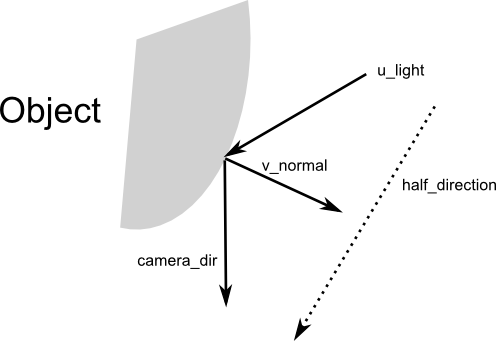
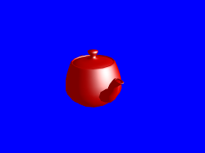

# Blinn-phong shading

Our current lighting model is a bit primitive.
We are going to modify it to use what is called *Blinn-Phong shading*.

This model is still very often used in commercial games, and has only recently been
superceded by physical-based rendering.

## Specular reflection

So what exactly is wrong with our current lighting?

When light hits an object, the light rays are split in two:

 - Some rays will be reflected in all directions. This is diffuse reflection.
 - Some rays will be reflected perpendicularly to the surface's normal, as if the object was a
   mirror. This is specular reflection.

When you take an individual fragment, the fragment's color is a combination of its diffuse and
specular reflections. Our current shader only takes into account diffuse reflection and not
specular.

So how does the calculation look like?

```glsl
#version 140

in vec3 v_normal;
in vec3 v_position;

out vec4 color;

uniform vec3 u_light;

const vec3 ambient_color = vec3(0.2, 0.0, 0.0);
const vec3 diffuse_color = vec3(0.6, 0.0, 0.0);
const vec3 specular_color = vec3(1.0, 1.0, 1.0);

void main() {
    float diffuse = max(dot(normalize(v_normal), normalize(u_light)), 0.0);

    vec3 camera_dir = normalize(-v_position);
    vec3 half_direction = normalize(normalize(u_light) + camera_dir);
    float specular = pow(max(dot(half_direction, normalize(v_normal)), 0.0), 16.0);

    color = vec4(ambient_color + diffuse * diffuse_color + specular * specular_color, 1.0);
}
```

The first line of the main function is more or less the same as what our previous shader was,
except that this time we fix the value so that it cannot be negative. This was not necessary
before because we used the `mix` function (which automatically handles this), but now we must
do it.

Then we calculate `camera_dir`, which is the direction of the camera relative to the object.
Since the camera is always at `(0, 0, 0)`, this is calculated simply by taking the opposite
of the position of the vector.



Afterwards we calculate `half_direction`, which is the direction of the camera relative to
the light if the camera and the light were both one unit away from the object. We then
calculate the cosine of the angle between `half_direction` and `v_normal` with
`dot(half_direction, normalize(v_normal))`.

If the `half_direction` is perpendicular to the normal, that means that the light rays coming
from the light bounce directly into the camera. The result of the calculation will be `1.0`.
Then we ensure that this value is positive and elevate it to the power 16. This means that
values like `0.98` will stay high, but values like `0.8` will almost drop to 0. The role of this
power is to mark a border between high values and low values. This is our specular coefficient.

The last step is to add everything together: ambient lighting (which is the lighting that
is present even if there is no light source) + diffuse lighting + specular lighting. Note that
in some circumstances the value can go above `1.0`, but OpenGL will automatically clamp it
to `1.0`.

Don't forget to modify our vertex shader to pass the additional `v_position` attribute by
adding this line at the end:

```glsl
v_position = gl_Position.xyz / gl_Position.w;
```

And here is the result:

 

The big white spots are the specular reflection.

**[You can find the entire source code here](https://github.com/tomaka/glium/blob/master/examples/tutorial-13.rs).**
